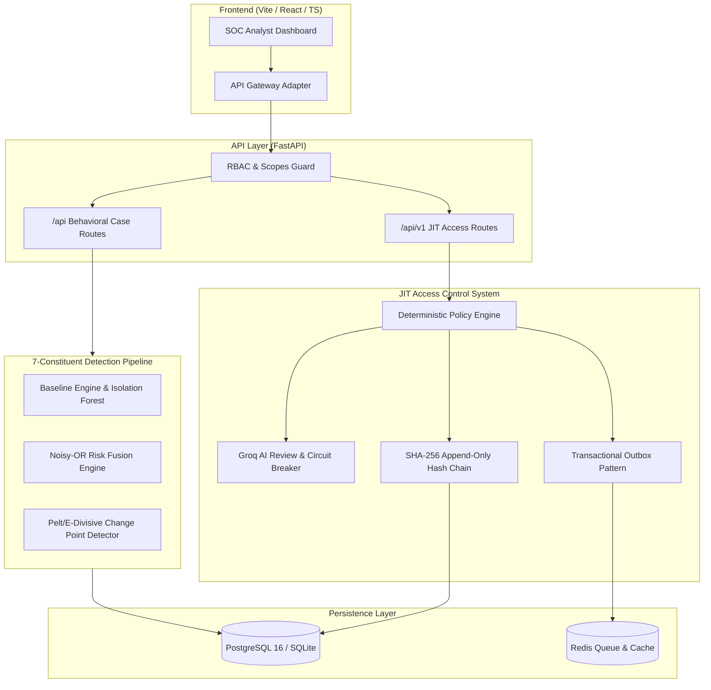

# System Architecture Specification

## Overview

FABLE is an enterprise behavioral security system designed to detect insider threat transitions, establish dynamic baseline behavior models, evaluate contextual justifications, and manage Just-In-Time (JIT) access grants with cryptographically verifiable audit trails.

---

## Key Subsystems

### 1. 7-Constituent Threat Detection Pipeline (`engine/`)
The behavioral risk pipeline computes versioned risk snapshots by evaluating telemetry across 7 distinct behavioral constituents:
1. **Self-Baseline Deviation**: Mahalanobis distance from individual historic activity.
2. **Peer-Cohort Deviation**: Divergence from departmental peer cluster baselines.
3. **Privilege Escalation**: IAM role transitions, elevation, step-up requests.
4. **Asset Sensitivity**: Data classification weights (Public, Internal, Restricted, Critical).
5. **Temporal Sequence Strength**: High-frequency or out-of-order action sequence anomaly.
6. **Behavior Anomaly Model**: Unsupervised Isolation Forest score.
7. **Login Risk**: Geo-velocity, ASN reputation, and device binding anomalies.

### 2. Noisy-OR Residual Risk Fusion
Signals are combined through a mathematically bounded Noisy-OR probability fusion function, modified by validated context grants:
$$\text{Residual Risk} = 1 - \prod_{i=1}^{n} (1 - S_i \times (1 - C_i))$$
Where $S_i$ is raw constituent score and $C_i$ is contextual attenuation credit. Unresolved critical violations enforce non-suppressible floor boundaries (e.g., 25% minimum floor per unresolved critical event).

### 3. 14-State JIT Access State Machine
JIT access requests transition deterministically through a 14-state lifecycle:
`DRAFT` $\rightarrow$ `PAUSED` $\rightarrow$ `EVIDENCE_READY` $\rightarrow$ `EVALUATED` $\rightarrow$ `AI_REVIEWED` $\rightarrow$ `AWAITING_APPROVAL` $\rightarrow$ `APPROVED` $\rightarrow$ `ENFORCING` $\rightarrow$ `ACTIVE` $\rightarrow$ `EXPIRED` / `REVOKED` / `DENIED` / `FAILED` / `MORE_CONTEXT_REQUIRED`.

### 4. SHA-256 Append-Only Audit Chain (`access_control/audit.py`)
Every access state transition appends an immutable `AuditRecord`. Each entry includes:
$$\text{Hash}_k = \text{SHA256}(\text{Hash}_{k-1} \parallel \text{Timestamp} \parallel \text{Actor} \parallel \text{Action} \parallel \text{StateTransition})$$
This guarantees tamper-evident historical auditability.

### 5. Transactional Outbox Worker (`access_control/worker.py`)
To prevent dual-write anomalies between database state and external enforcement webhook dispatch, mutations append to `TransactionalOutbox`. The worker process polls outbox entries, executes HMAC-SHA256 signed webhooks, and records status asynchronously.
